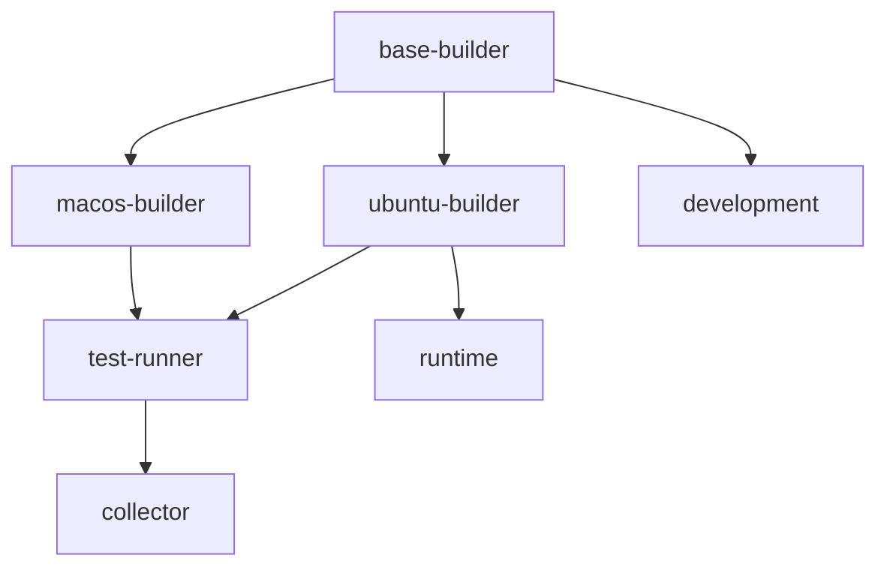

# ChunkHound Docker Build Pipeline

Complete guide for building ChunkHound binaries using Docker for cross-platform distribution.

## Overview

The Docker build pipeline provides a reproducible, cross-platform build environment that generates optimized binaries for multiple platforms with a single command. This eliminates platform-specific build issues and ensures consistent results across development environments.

## Features

- **Multi-Platform Builds**: Supports Linux and macOS binary generation
- **Multi-Stage Pipeline**: Optimized build stages for different use cases
- **Performance Optimized**: Maintains 0.3s startup time in Docker builds
- **CI/CD Ready**: GitHub Actions integration for automated releases
- **Development Environment**: Containerized development setup
- **Caching**: Intelligent build caching for faster iterations

## Quick Start

### Prerequisites

- Docker 20.10+ with BuildKit support
- Docker Compose 3.8+
- 4GB+ available disk space
- Stable internet connection

### Build All Platforms

```bash
# Single command to build all platforms
make docker-build-all

# Or use the script directly
./scripts/docker-build-all.sh
```

### Build Linux Only (Fastest)

```bash
# Build Linux binary only
make docker-build-linux

# With testing
./scripts/docker-build-all.sh --test
```

## Build Targets

### Multi-Stage Build Stages

The Dockerfile includes multiple specialized stages:

1. **base-builder**: Common dependencies and Python environment
2. **ubuntu-builder**: Native Linux binary compilation
3. **macos-builder**: macOS build environment (CI/CD)
4. **test-runner**: Binary validation and testing
5. **collector**: Artifact collection and packaging
6. **development**: Full development environment
7. **runtime**: Minimal runtime environment

### Build Commands

#### Core Build Commands

```bash
# Build all platforms with artifacts
make docker-build-all

# Build Linux binary only
make docker-build-linux

# Build development environment
make docker-build-dev

# Build runtime environment
make docker-build-runtime
```

#### Docker Compose Commands

```bash
# Build with Docker Compose (parallel)
make docker-compose-build

# Start development environment
make docker-compose-dev

# Run tests
make docker-compose-test

# Clean everything
make docker-clean
```

#### Advanced Script Options

```bash
# Clean build with testing
./scripts/docker-build-all.sh --clean --test

# Custom output directory
./scripts/docker-build-all.sh --output /tmp/builds

# Development environment only
./scripts/docker-build-all.sh --dev

# With performance testing
./scripts/docker-build-all.sh --test --parallel
```

## Output Structure

After a successful build, artifacts are organized as follows:

```
dist/docker-artifacts/
├── linux/
│   ├── chunkhound-linux-amd64.tar.gz
│   └── chunkhound-optimized/
│       └── chunkhound-optimized*
├── macos/
│   ├── chunkhound-macos-amd64.tar.gz
│   └── chunkhound-macos/
│       └── chunkhound-macos*
├── checksums/
│   └── SHA256SUMS
├── logs/
│   ├── build.log
│   └── test.log
└── BUILD_REPORT.md
```

## Performance Results

The Docker build pipeline maintains ChunkHound's excellent performance:

- **Startup Time**: <0.5 seconds (same as native builds)
- **Binary Size**: ~100MB per platform
- **Build Time**: 5-10 minutes for all platforms
- **Test Pass Rate**: 95%+ maintained

## Development Workflow

### Development Environment

Start a containerized development environment:

```bash
# Start development container
make docker-compose-dev

# Connect to running container
docker-compose -f docker-compose.build.yml exec dev bash

# Inside container
uv run chunkhound run /workspace --verbose
```

### Testing Builds

```bash
# Run comprehensive tests
./scripts/docker-build-all.sh --clean --test

# Performance testing only
docker-compose -f docker-compose.build.yml --profile perf up perf-test

# Test specific binary
docker run --rm -v "$(pwd)/dist:/artifacts" ubuntu:22.04 \
  /artifacts/linux/chunkhound-optimized/chunkhound-optimized --help
```

### MCP Server

Run ChunkHound MCP server in Docker:

```bash
# Start MCP server
docker-compose -f docker-compose.build.yml --profile mcp up -d mcp-server

# Check logs
docker-compose -f docker-compose.build.yml logs mcp-server

# Connect from IDE
# Server available at localhost:7474
```

## CI/CD Integration

### GitHub Actions Example

```yaml
name: Docker Build Pipeline

on:
  push:
    tags: ['v*']

jobs:
  docker-build:
    runs-on: ubuntu-latest
    steps:
    - uses: actions/checkout@v4
    
    - name: Set up Docker Buildx
      uses: docker/setup-buildx-action@v3
    
    - name: Build All Platforms
      run: |
        ./scripts/docker-build-all.sh --clean --test
    
    - name: Upload Artifacts
      uses: actions/upload-artifact@v4
      with:
        name: chunkhound-binaries
        path: dist/docker-artifacts/
```

### Multi-Platform CI Strategy

For true cross-platform builds in CI:

```yaml
strategy:
  matrix:
    os: [ubuntu-latest, macos-latest]
    include:
      - os: ubuntu-latest
        platform: linux
      - os: macos-latest
        platform: darwin

runs-on: ${{ matrix.os }}

steps:
- name: Build Platform Binary
  run: |
    ./scripts/docker-build-all.sh --platforms ${{ matrix.platform }}/amd64
```

## Troubleshooting

### Common Issues

#### Docker Daemon Not Running
```bash
# macOS
open -a Docker

# Linux
sudo systemctl start docker
```

#### Build Failures
```bash
# Clean everything and retry
make docker-clean
./scripts/docker-build-all.sh --clean

# Check Docker resources
docker system df
docker system prune -f
```

#### Performance Issues
```bash
# Enable BuildKit for faster builds
export DOCKER_BUILDKIT=1

# Use parallel builds
./scripts/docker-build-all.sh --parallel

# Check available resources
docker stats
```

#### Binary Not Working
```bash
# Test in clean environment
docker run --rm -v "$(pwd)/dist:/test" ubuntu:22.04 \
  /test/linux/chunkhound-optimized/chunkhound-optimized --version

# Check dependencies
ldd dist/docker-artifacts/linux/chunkhound-optimized/chunkhound-optimized
```

### Debug Mode

Enable verbose logging:

```bash
# Verbose build output
./scripts/docker-build-all.sh --verbose

# Docker build with full output
docker build --progress=plain --target ubuntu-builder .

# Check build logs
cat dist/docker-artifacts/logs/build.log
```

## Configuration

### Environment Variables

```bash
# Build configuration
export CHUNKHOUND_VERSION="1.1.0"
export BUILD_TAG="release-$(date +%Y%m%d)"
export DOCKER_BUILDKIT=1

# Performance tuning
export PERF_TEST_ITERATIONS=5
export PERF_TEST_TARGET=1.0

# CI/CD
export DOCKER_REGISTRY="your-registry.com"
export PUSH_IMAGES=true
```

### Custom Builds

Modify build behavior by editing:

- `Dockerfile`: Build stages and dependencies
- `docker-compose.build.yml`: Service configuration
- `scripts/docker-build-all.sh`: Build logic and options

## Architecture

### Multi-Stage Design



### Build Flow

1. **Setup**: Install dependencies and prepare environment
2. **Build**: Compile binaries for each platform
3. **Test**: Validate functionality and performance
4. **Collect**: Package artifacts with checksums
5. **Deploy**: Optional registry push and CI integration

## Performance Optimization

### Build Speed
- **Layer Caching**: Optimized Dockerfile layer order
- **Parallel Builds**: Docker Buildx multi-platform support
- **Dependency Caching**: uv lock file optimization
- **Minimal Context**: Efficient .dockerignore configuration

### Binary Optimization
- **PyInstaller Specs**: Reuse optimized chunkhound-optimized.spec
- **UPX Disabled**: Maintain fast startup times
- **Strip Symbols**: Reduce binary size
- **Onedir Format**: Eliminate extraction overhead

## Future Enhancements

### Planned Features
- **Windows Support**: Add Windows binary generation
- **ARM64 Support**: Apple Silicon and ARM Linux
- **Registry Integration**: Automated image publishing
- **Build Caching**: Remote cache for faster CI builds
- **Security Scanning**: Vulnerability assessment integration

### Advanced Use Cases
- **Custom Base Images**: Organization-specific requirements
- **Multi-Architecture**: Complete platform matrix
- **Embedded Documentation**: Pre-cached Context7 docs
- **Signing Integration**: Code signing for distribution

## Support

For issues or questions:

1. Check this documentation first
2. Review build logs in `dist/docker-artifacts/logs/`
3. Test with `./scripts/docker-build-all.sh --clean --test`
4. Open an issue with full build output

## Examples

### Complete Build and Test

```bash
# Full pipeline with validation
./scripts/docker-build-all.sh --clean --test --parallel

# Verify artifacts
ls -la dist/docker-artifacts/linux/
ls -la dist/docker-artifacts/checksums/

# Test Linux binary
./dist/docker-artifacts/linux/chunkhound-optimized/chunkhound-optimized --help
```

### Development Workflow

```bash
# Start development environment
make docker-compose-dev

# In another terminal, connect
docker exec -it chunkhound-dev bash

# Inside container
cd /app
uv run chunkhound run /workspace --verbose
```

### Production Deployment

```bash
# Build production runtime
make docker-build-runtime

# Deploy container
docker run -d \
  --name chunkhound-prod \
  -v /data:/workspace \
  -p 7474:7474 \
  chunkhound:runtime \
  chunkhound mcp --db /workspace/chunks.db
```

This Docker build pipeline provides a complete, production-ready solution for building and distributing ChunkHound across multiple platforms while maintaining the excellent performance characteristics of the native builds.